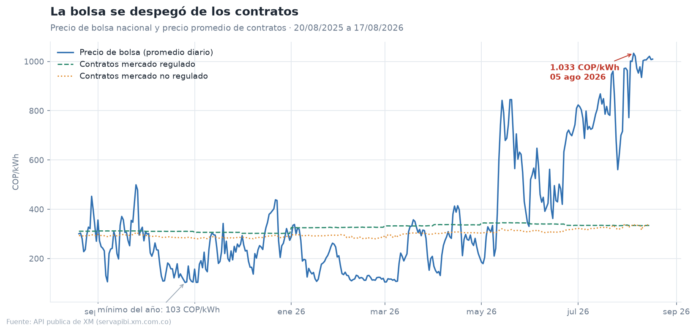
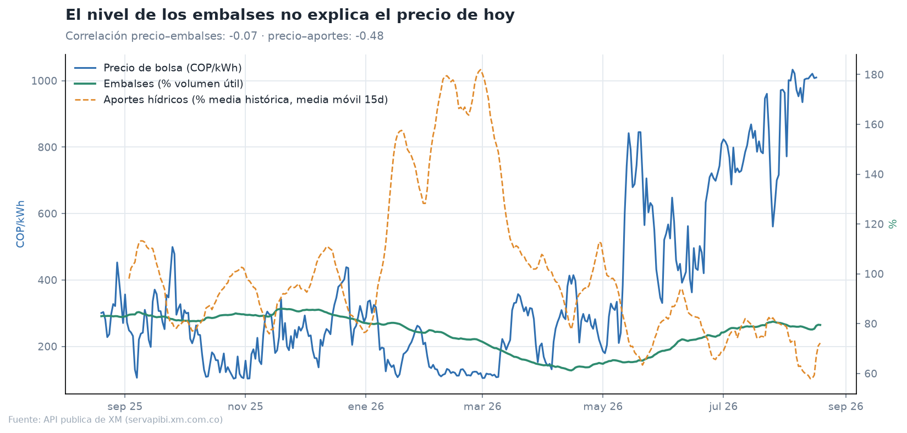
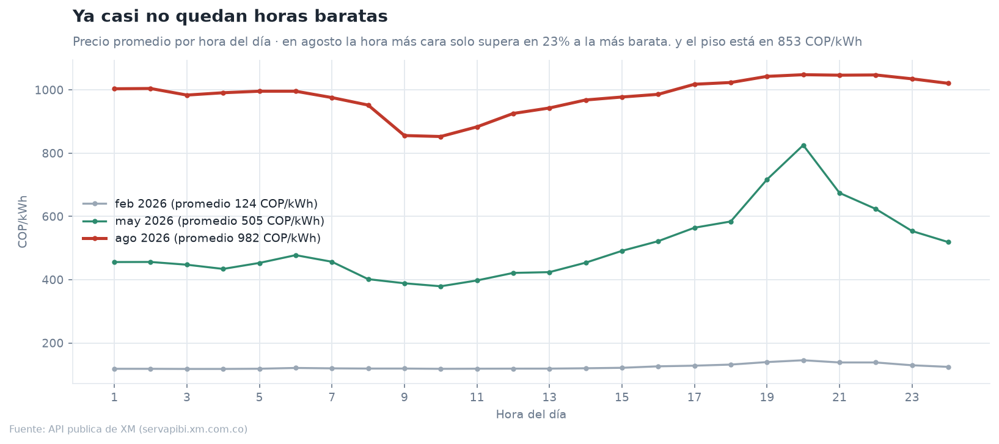
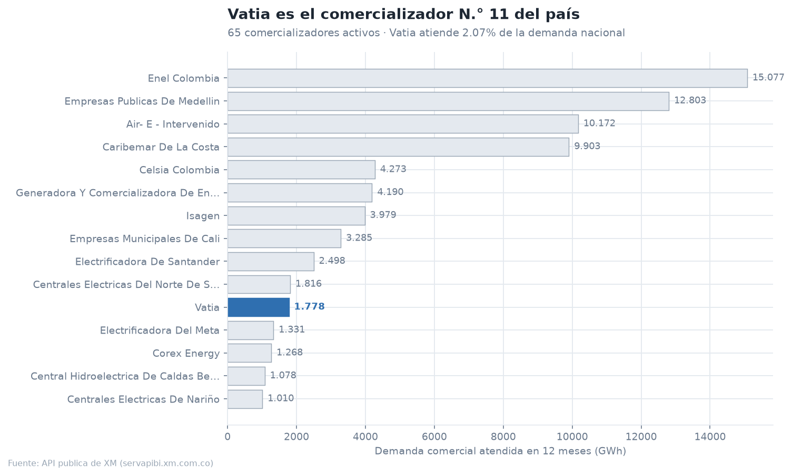
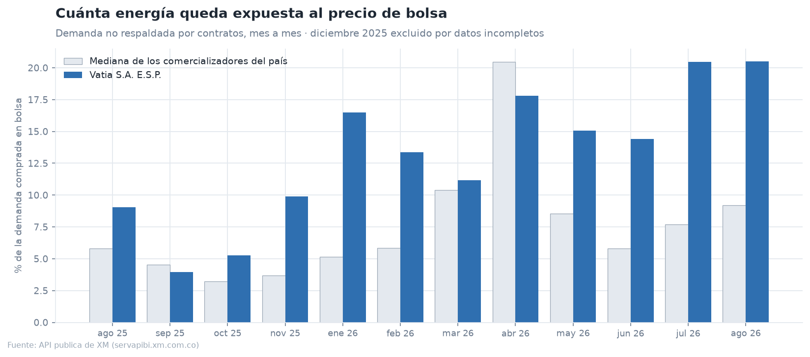
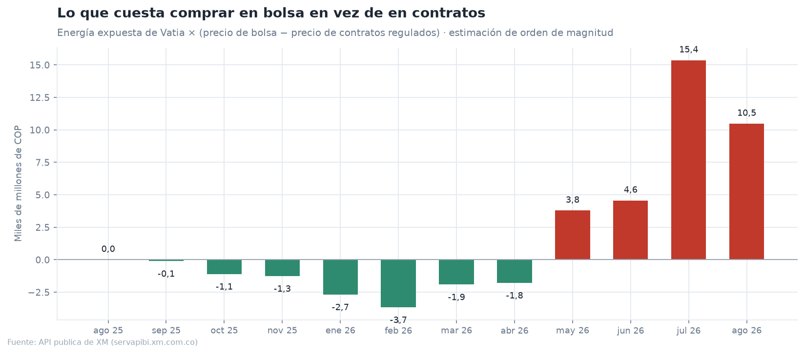

# Mercado eléctrico colombiano — análisis con datos públicos de XM

Análisis de los últimos 12 meses del mercado de energía mayorista en Colombia
(**20/08/2025 a 17/08/2026**) a partir de la API pública de XM, el operador del
mercado. Todo el proyecto se ejecuta con un comando y no usa ningún dato privado.

Lo hice para entender cómo funciona el negocio de una comercializadora de energía
antes de postularme a una práctica en el sector. No tengo experiencia profesional
en energía: lo que hay acá salió de leer la documentación de XM y de trabajar los
datos.

**Autor:** Ángel Farid Agreda Vargas — estudiante de Ingeniería de Sistemas,
Universidad Libre Seccional Cali · [github.com/angelfvargas](https://github.com/angelfvargas)

---

## Los cinco hallazgos

### 1. La bolsa se triplicó frente a los contratos, y no fue la sequía

El precio de bolsa promedió **361,8 COP/kWh** en los 12 meses, pero pasó de
**124 COP/kWh en febrero de 2026** a **982 COP/kWh en agosto de 2026**, con un
máximo diario de **1.033 COP/kWh el 5 de agosto de 2026**. Los contratos, en
cambio, siguieron cerca de **334 COP/kWh** en el mercado regulado. Hoy la energía
comprada en bolsa cuesta cerca de **2,9 veces** la comprada en contratos.



### 2. Los embalses están normales — la explicación no es hidrológica

El reflejo es culpar al clima, pero los embalses cerraron la ventana en **78,5%**
de volumen útil, por encima del promedio del año (**76,3%**), y la correlación
entre precio y nivel de embalses es prácticamente **cero (−0,07)**. La correlación
con los aportes hídricos sí existe pero es moderada (**−0,48**), y en agosto los
aportes están en **68,7%** de su media histórica. Es decir: hay agua almacenada, pero
está entrando menos de lo normal y el precio responde más a eso — y a la oferta
térmica — que al nivel de los embalses.



### 3. Ya casi no quedan horas baratas

En mayo de 2026 el día todavía tenía forma: valle en la madrugada y pico a las
20:00, con el pico casi al doble del valle. En agosto de 2026 la curva se aplanó
hacia arriba — la hora más barata ya está en **853 COP/kWh** y la más cara solo la
supera en **23%**. Para un cliente no regulado que quiera bajar su factura moviendo
consumo a horas baratas, hoy ese margen es mucho más estrecho que hace tres meses.



### 4. Vatia es el comercializador N.° 11 del país

De **65 comercializadores activos**, Vatia atendió **1.777,5 GWh** en 12 meses,
el **2,07%** de la demanda nacional. Su mercado es **90% regulado** (1.599,2 GWh)
y 10% no regulado (178,3 GWh).



### 5. La exposición a bolsa dejó de ser un ahorro y pasó a ser un costo

Cruzando la demanda de cada comercializador con la energía que tiene respaldada en
contratos se ve qué porcentaje termina comprando en bolsa. Vatia compró en bolsa
un **13,1% de su demanda** en promedio durante el año y **20,5% en agosto de 2026**,
frente a una mediana del mercado de **7,5%** y **9,2%**.



Esa exposición no era mala: mientras la bolsa estuvo barata, comprar allí en vez de
en contratos **ahorraba** dinero (barras verdes). Desde mayo de 2026 el signo se
invirtió. Valorando la energía expuesta contra el precio de contratos regulados, el
diferencial pasa a **+15,4 mil millones de COP en julio de 2026** y **+10,5 mil
millones en lo corrido de agosto**.



> Es una estimación de orden de magnitud, no la posición financiera real de la
> empresa: usa el precio promedio de contratos del sistema, no el de los contratos
> de cada agente (que no es público), y no incluye contratos de respaldo, coberturas
> financieras ni el cargo por confiabilidad.

---

## Dos cosas que aparecieron al trabajar los datos

**Las etiquetas de contratos cambian de orientación según el mes.** En las series
por agente, `CompContEner` y `VentContEner` son los dos lados del mismo contrato y
suman exactamente igual a nivel sistema (verificado: 10.237,7 GWh contra 10.237,7 GWh
en julio de 2026). Pero cuál de las dos trae la energía que respalda la demanda de un
comercializador **cambia**: hasta junio de 2026 venía en `CompContEner`, y en julio y
agosto de 2026 —y también en diciembre de 2025— viene en `VentContEner`. Tomarlo
literalmente da resultados imposibles, como que Enel comprara en bolsa el 196% de su
demanda. La solución que quedó en el código es no confiar en la etiqueta: para cada
agente y mes se toma el mayor de los dos valores como la energía que respalda su
demanda y el menor como sus ventas a terceros. Con esa regla, las exposiciones de
todos los comercializadores caen en el rango razonable de 0% a 35%.

**Diciembre de 2025 quedó fuera.** Ese mes la energía en contratos reportada cae para
todos los agentes a la vez, lo que dispara la exposición aparente del mercado entero
a valores de 50% a 97%. Es un problema de la fuente, no del cálculo, así que el mes se
excluye de las gráficas de exposición y de costo, y así está anotado en ellas.

---

## Cómo correrlo

```bash
python3 -m venv .venv
.venv/bin/pip install pandas matplotlib requests pyarrow
.venv/bin/python src/descargar.py   # ~25 min la primera vez, luego lee de caché
.venv/bin/python src/analisis.py    # gráficas + hallazgos.json
```

## Estructura

| Archivo | Qué hace |
|---|---|
| `src/xm_api.py` | Cliente de la API de XM: parte el rango en tramos de 30 días (el máximo que acepta), reintenta ante fallos y cachea cada respuesta en disco |
| `src/descargar.py` | Descarga las series usadas: precio de bolsa, demanda comercial, contratos, embalses, aportes y precio de escasez |
| `src/analisis.py` | Calcula la posición contractual de cada agente y genera las seis gráficas y `hallazgos.json` |
| `src/estilo.py` | Estilo común de las gráficas |
| `hallazgos.json` | Todas las cifras citadas arriba, generadas por el código — ningún número de este README está escrito a mano |

## Fuente

API pública de XM — `https://servapibi.xm.com.co`. Métricas usadas: `PrecBolsNaci`,
`DemaCome`, `DemaComeReg`, `DemaComeNoReg`, `CompContEner`, `VentContEner`,
`PrecPromContRegu`, `PrecPromContNoRegu`, `PorcVoluUtilDiar`, `PorcApor`,
`PrecEscaAct`, `ListadoAgentes`.

Datos descargados el 20 de agosto de 2026. La liquidación del mercado tiene unos
días de rezago, por eso la ventana termina el 17 de agosto.
